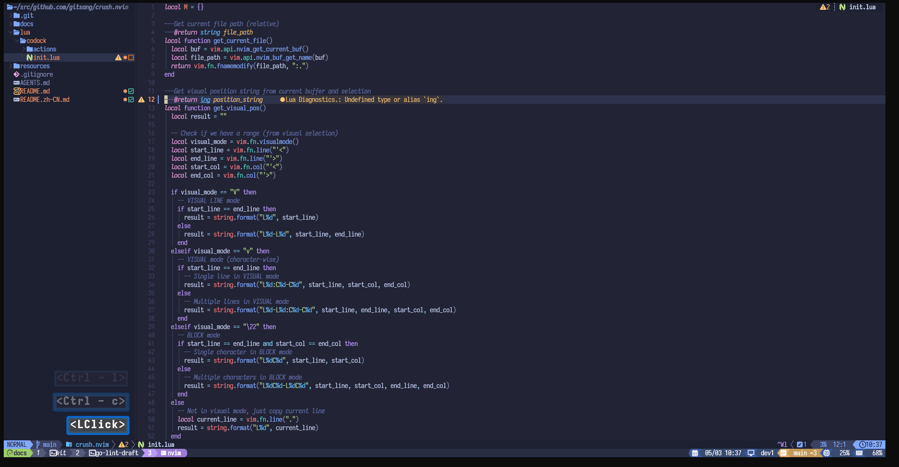

# crush.nvim

A Neovim plugin that opens a terminal with the [Crush CLI](https://github.com/charmbracelet/crush)
in a vertical split.



> And yes, because it doesn't have direct coupling with the Crush CLI,
> theoretically it can be used with any CLI tool, such as
> `crush_cmd = "claude"` or `crush_cmd = "mycli -h localhost -P 3389"` etc.
>
> But I think I might further add some features specifically adapted for Crush,
> so I still name it `crush.nvim`.
>
> If you just want a plugin to open Terminal Tools in the sidebar, of course
> you can continue using it. Or, You can fork this code.
>
> At least for now, it's really simple, only 70+ lines of code, as long as you
> have a little programming foundation, even if you don't need to be a Lua
> programming foundation, you can easily modify it.

## 1. Installation

Using [lazy.nvim](https://github.com/folke/lazy.nvim):

```lua
{
  'gitsang/crush.nvim',
  opts = {
    width = 80,         -- Width of the vertical split
    fixed_width = true, -- Whether to fix the width (true = locked, false = adjustable)
    crush_cmd = "crush" -- Command to run in the terminal
  },
  cmd = { "Crush", "CrushFile" },
  keys = {
    { "<leader>C", "<cmd>Crush<cr>", desc = "Toggle Crush" },
    { "<leader>F", "<cmd>CrushFile<cr>", desc = "Copy file path and line info", mode = { "n", "v", "V", "\22" } },
  },
}
```

## 2. Usage

After installation, you can run the following commands:

### 2.1 Crush Command

Run the `:Crush` command to open a terminal in a vertical split running the crush command.

### 2.2 CrushFile Command

The `:CrushFile` command copies the relative file path and line/column information to the clipboard in various visual modes:

- **VISUAL LINE mode (`V`)**:
  - Single line: `README.md:L30`
  - Multiple lines: `README.md:L30-L40`

- **VISUAL mode (`v`)**:
  - Single line: `README.md:L30:C14-C18`
  - Multiple lines: `README.md:L30-L40:C14-C18`

- **BLOCK mode (`Ctrl+v`)**:
  - Single character: `README.md:L30C14`
  - Multiple characters: `README.md:L30C14-L40C18`

- **Normal mode**:
  - Current line: `README.md:L30`

The copied path and line information can be directly pasted into comments, documentation, or shared with others.

### 2.1 Configuration

The plugin can be configured with the following options:

- `width`: Integer for the vertical split width (default: 80)
- `crush_cmd`: String for the command to run (default: "crush")

Example configuration:

```lua
require('crush').setup({
  width = 100,
  crush_cmd = "crush --yolo"
})
```

Then run `:Crush` to open the terminal, or use `:CrushFile` to copy file paths with line information.
