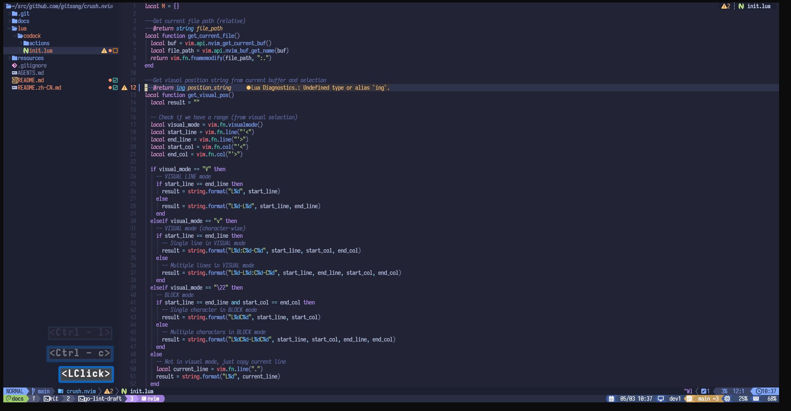

# codock.nvim

English | [中文](./README.zh-CN.md)

A Neovim plugin that opens a terminal with Coding Agent CLI tools (crush, opencode, claude, gemini-cli, etc.) in a vertical split.



## 1. Installation

Using [lazy.nvim](https://github.com/folke/lazy.nvim):

```lua
{
  'gitsang/codock.nvim',
  opts = {
    width = 80, -- Width of the vertical split
    fixed_width = true, -- Whether to fix the width (true = locked, false = adjustable)
    codock_cmd = "opencode", -- Command to run in the terminal (crush, opencode, claude, gemini-cli, etc.)
    copy_to_clipboard = false, -- Copy to system clipboard
    actions = {},
  },
  cmd = { "Codock", "CodockFilePos", "CodockActions" },
  keys = {
    { "<leader>CC", "<cmd>Codock<cr>", desc = "Toggle Codock", mode = { "n", "v" } },
    { "<leader>CP", ":'<,'>CodockFilePos<cr>", desc = "Copy file path and line info", mode = { "n", "v" } },
    { "<leader>CA", ":'<,'>CodockActions<cr>", desc = "Run Codock actions", mode = { "n", "v" } },
  },
}
```

## 2. Usage

After installation, you can run the following commands:

### 2.1 Codock Command

Run the `:Codock` command to open a terminal in a vertical split running the configured AI CLI command.

### 2.2 CodockFilePos Command

The `:CodockFilePos` command copies the relative file path and line/column information to the clipboard in various visual modes, then send it to the AI CLI tool.

### 2.3 CodockActions Command

The `:CodockActions` command allows you to define custom actions that can be executed from a popup selector.

You can find how to define your own actions in [Custom Actions Tutorial](docs/actions.md)

## 3. Supported AI CLI Tools

This plugin supports various AI CLI tools:

- `crush` - [Crush CLI](https://github.com/charmbracelet/crush)
- `opencode` - OpenCode
- `claude` - Claude Code
- `gemini-cli` - Gemini CLI

Simply set the `codock_cmd` option to your preferred AI CLI tool.
